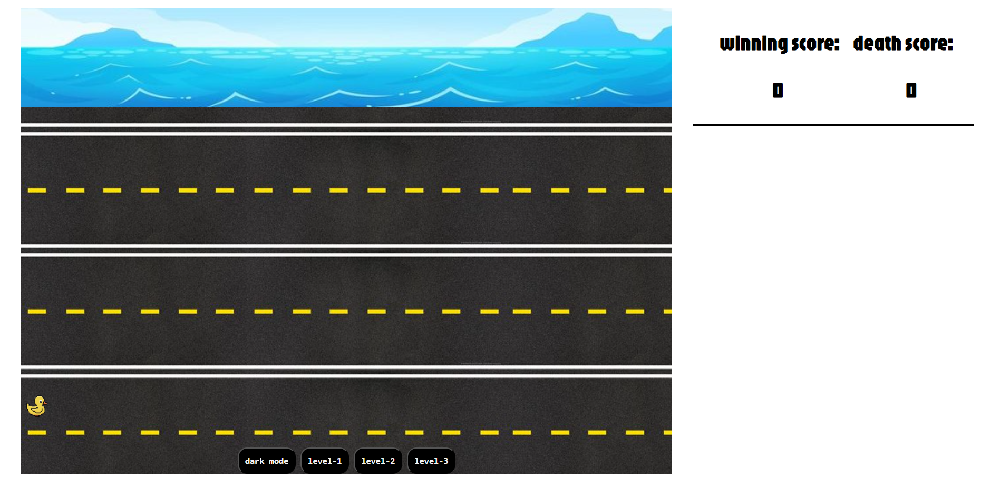
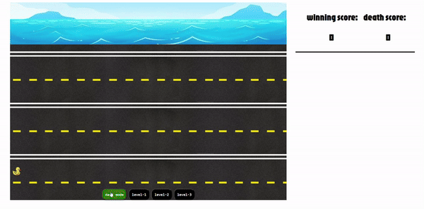
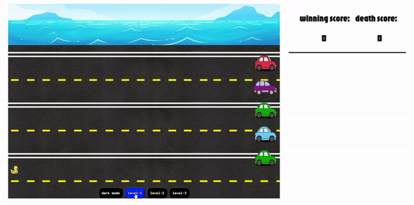

# Duck Streat

## Date: 5/5/2024

### By: Hussain Al Aradi

#### [Gmail](hussainAlAradi.ha@gmail.com) | [GitHub](https://github.com/HussainALAradi5) | [LinkedIn](https://www.linkedin.com/in/hussain-ahmed-ali-al-aradi-292182292/)

---

### **_Description_**

#### this project is a nice game, you will play as a duck who went to reach the water in order to win, but you must avoid the cars in order to reach your goal.

---

### **_Technologies Used_**

- JS
- CSS(for design)
- HTML

---

### **_Getting Started_**

##### just play the game and enjoy it

---

### **_Screenshots_**

##### image header 1

##### image header 2

## 

## 

### **_Future Updates_**

- [x] add random cars color
- [ ] Future Update 2
- [x] duck movement
- [x] winning score
- [x] death score

---

### **_Credits_**

##### my colluge(Jasim Khalef,abdulla hisham,yusif zaman and other friends ) who help me in the CSS part

##### inspired by:the frogger video game

##### google for photos

---
